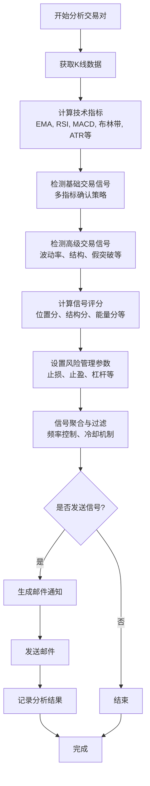
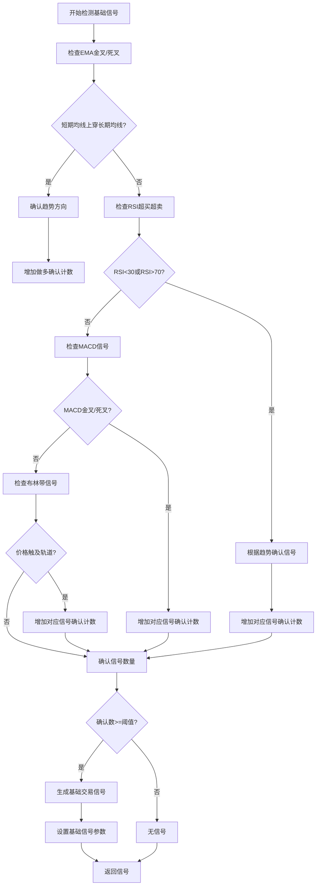
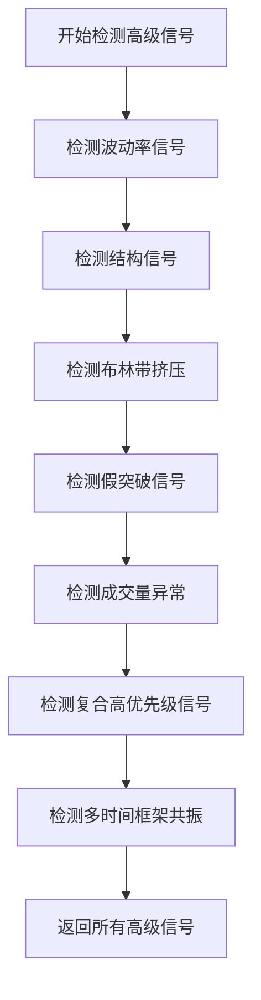
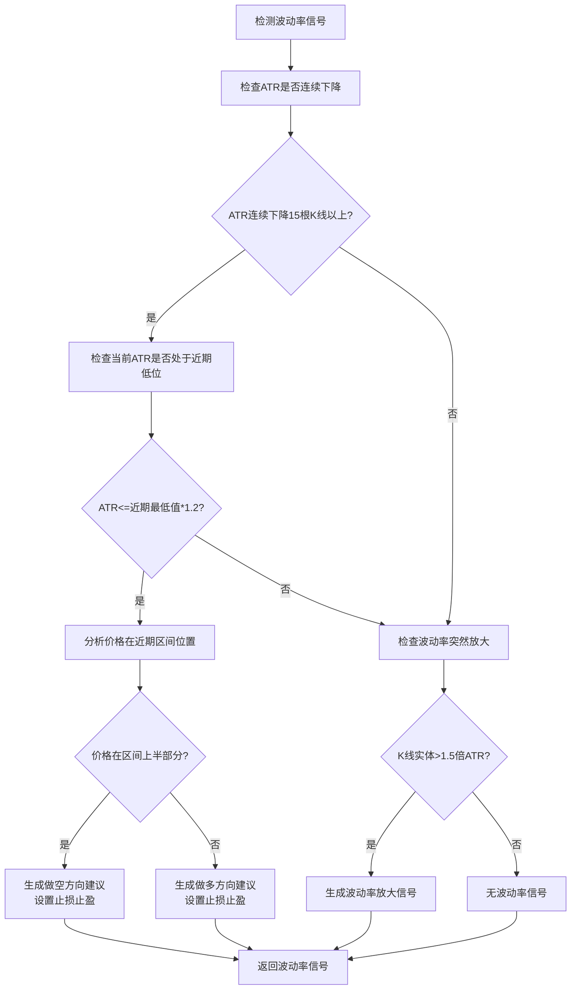
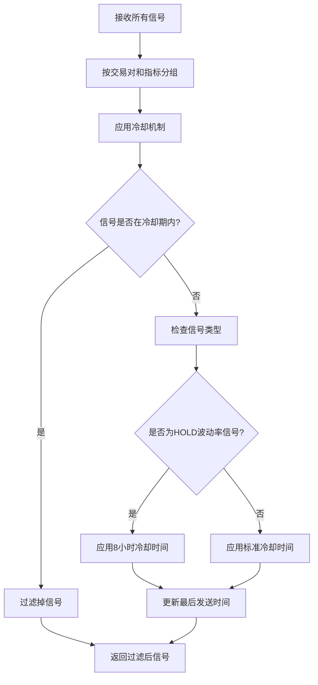
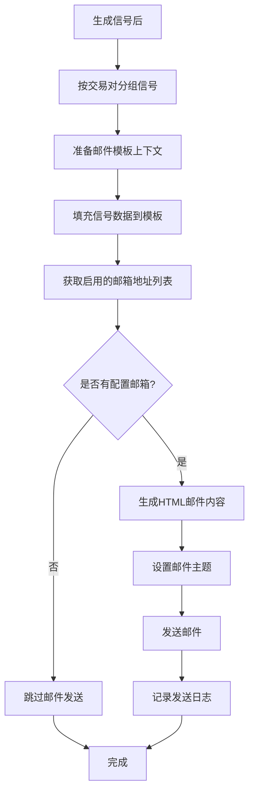

# TradeWise 开单信号生成流程

## 信号生成主流程



## 基础信号检测流程



## 高级信号检测流程



## 波动率信号检测流程



## 信号评分与风险管理流程

```mermaid
flowchart TD
    A[计算信号评分] --> B[计算位置分]
    B --> C[计算结构分]
    C --> D[计算能量分]
    D --> E[计算时间分]
    E --> F[计算环境分]
    F --> G[汇总得分(0-10分)]
    G --> H[设置信号等级<br/>LEVEL_1(8-10分)<br/>LEVEL_2(6-7分)<br/>LEVEL_3(4-5分)]
    
    H --> I[风险管理参数计算]
    I --> J[计算止损位]
    J --> K[计算止盈位]
    K --> L[计算杠杆倍数]
    L --> M[计算所需保证金]
    M --> N[计算预期收益率]
    N --> O[计算预估爆仓价]
    O --> P[返回完整信号]
```

## 信号聚合与过滤流程



## 邮件通知流程

